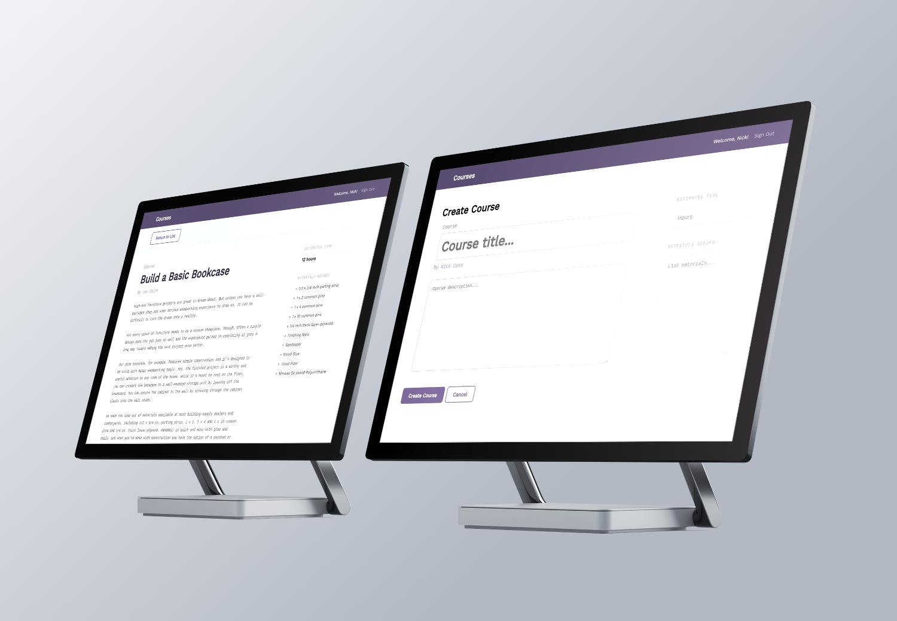
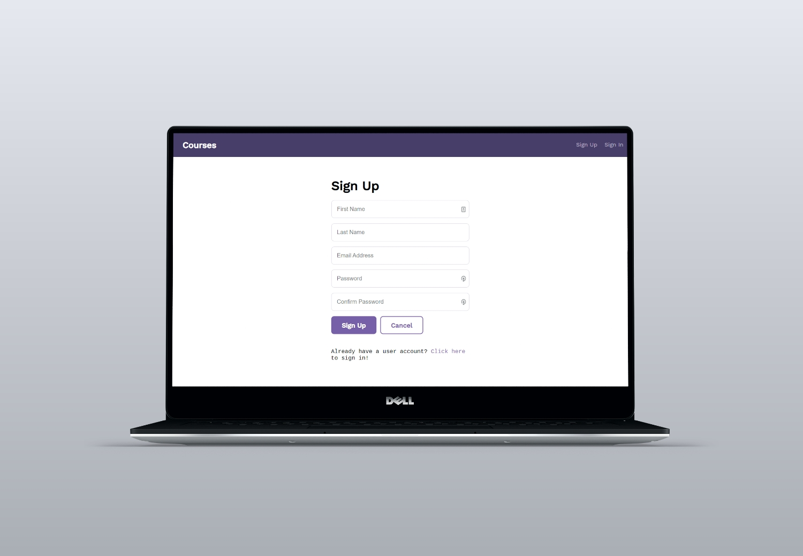
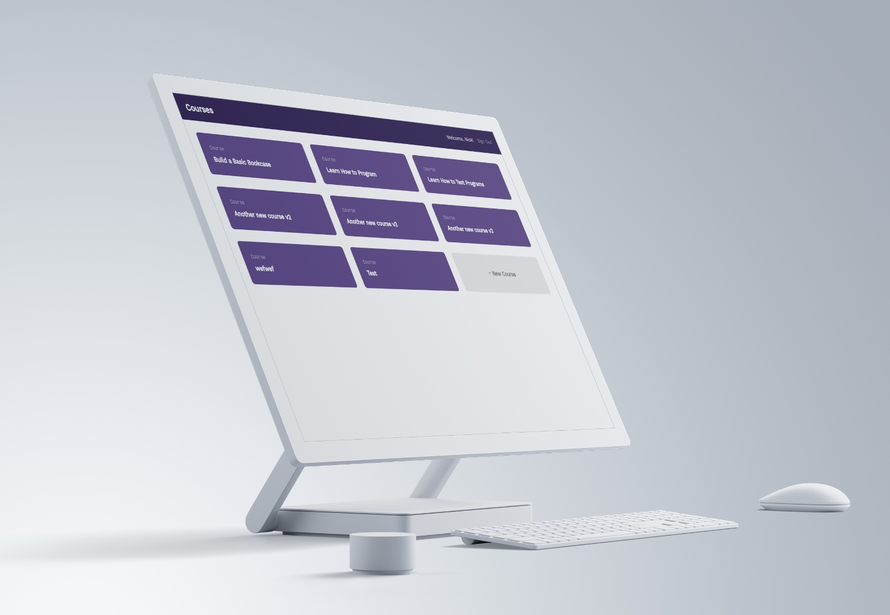

# Full Stack React and Rest API Application

This web application uses React for the client and then a REST API for the database. In a nutshell the application is where users can administer a school database containing information about different courses. They can interact with the database by retrieving a list of course, viewing details for a specific course, as well as creating, updating and deleting courses in the database. 

A login and sign up functionality has also been implemented, in order for users to create and delete their own courses, and not be able to delete another users course etc.







## How to use the project

After downloading or cloning the repo, you will need to open the project in your terminal and ensure that have Node.js (version 10 or lower) and NPM installed. Once in the route folder, navigate to the 'api' folder.

```
cd api
```

Install all of the dependencies for the REST API using the following command:

```
npm install
```

Second, seed the SQLite database.

```
npm run seed
```

And lastly, start the application

```
npm start
```

Open a new terminal and ensure you're in the route folder again, and now navigate to the 'client' folder. 

```
cd client
```

Install all of the dependencies for the client using the following command:

```
npm install
```

And finally, start the application

```
npm start
```

The application should start up using port 3000 in your browser.

## Built With

* [NodeJS](https://nodejs.org/en/)
* [Express](https://expressjs.com/)
* [React](https://reactjs.org/)
* [SQLite](https://www.sqlite.org/index.html)